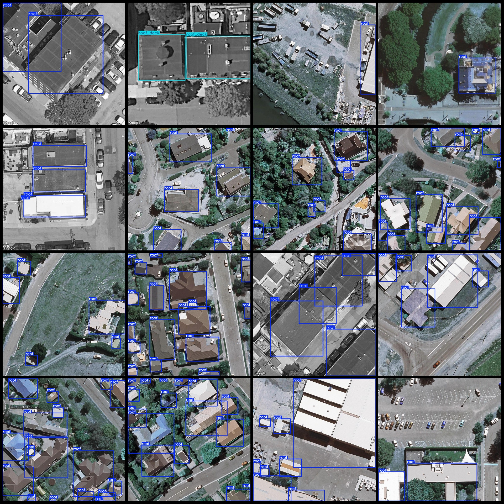
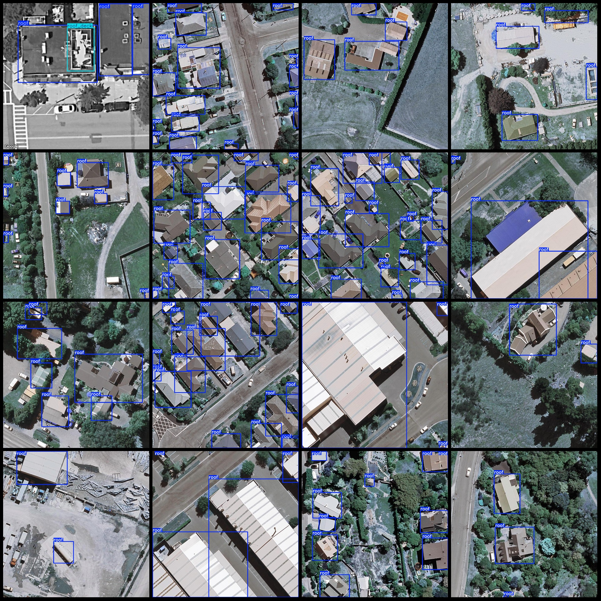

# UAV Perspective Roof Detection Dataset: VOC+YOLO Format, 4107 Images in 2 Classes

Dataset format: Pascal VOC format + YOLO format (without split paths in txt files, only containing jpg images along with corresponding VOC format xml files and yolo format txt files)
Image count (number of jpg files): 4107
Annotation count (number of xml files): 4107
Annotation count (txt files): 4107
Number of categories: 2
Category names for the annotation: ["roof", "roof_deck"] (Note that the order of categories in the yolo format does not correspond to this list, but rather follows the labels folder's classes.txt)
Number of boxes per category:
- roof (roof) = 33926
- roof_deck (roof deck) = 360
Total number of boxes: 34286
Number of images per category:
- roof (roof) = 4103
- roof_deck (roof deck) = 186
Image resolution: 1000x1000
Annotation tool used: labelImg
UAV: DJI MAVIC 3
Collection height: 50m
Collection angle: 90°
Annotation rules: draw a square box around the category
Important note: The dataset does not have separate training, validation, or test sets; they need to be manually divided.
Special statement: This dataset does not guarantee the accuracy of trained models or weights files.
Image previews:
Annotation example:

## Images

Here is a pay link on Stripe ( https://buy.stripe.com/3cs8yP7sY87d0vu9AB ). Please contact me lonlonago@foxmail.com after funding $89, and I will send you a complete data files , thank you!

